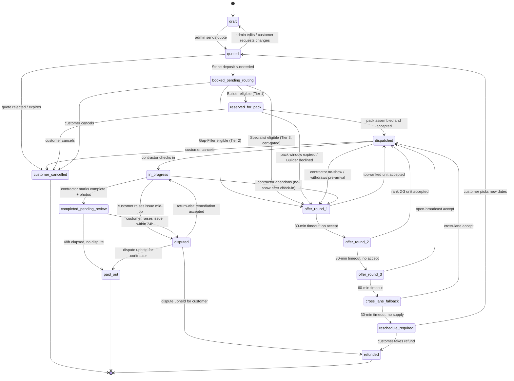

# Booking State Machine

**Status:** Wave 1 — authoritative
**Depends on:** `data-model.md` (booking_state column), `feature-flags.md` (FF_ROUTING_ENGINE, FF_DAY_PACK)
**Consumed by:** modules 05 (Routing Engine), 06 (Day-Pack Solver), 07 (Pay Protection), 08 (Control Tower)

---

## 1. Overview

Every booking moves through a single linear state machine stored on
`personalizedQuotes.booking_state`. It is the spine that ties customer
payment, supply routing, dispatch, contractor pay protection, and Stripe
Connect payout into one ordered set of transitions. Each transition writes
to `booking_state_log` (append-only). Cron timeouts force forward
progression so no booking gets stuck. Rollbacks drop a booking back to a
prior state and re-fire the trigger. A `version int` on `personalizedQuotes`
gives us optimistic locking, so duplicate events are no-ops. Modules emit
transition **intents** to a central `bookingStateMachine.transition()`
function — they never write the column directly.

---

## 2. State diagram

---

## 3. Transition table

| From | To | Trigger | Side effects | Timeout |
|---|---|---|---|---|
| `[*]` | `draft` | Admin creates quote | Row inserted; `version=1` | — |
| `draft` | `quoted` | Admin clicks "Send" | SMS/email with quote URL; `expiresAt` set | — |
| `quoted` | `draft` | Admin edits / customer asks for change | Old URL invalidated; new revision drafted | — |
| `quoted` | `booked_pending_routing` | Stripe `payment_intent.succeeded` webhook | `depositPaidAt`/`bookedAt` set; `lead.stage='converted'`; routing trigger fired | — |
| `quoted` | `customer_cancelled` | Reject / no payment by `expiresAt` | Notify admin; release soft holds | 15 min |
| `booked_pending_routing` | `reserved_for_pack` | Routing sees Builder coverage; flex_tier ≠ Fast | Tagged `pack_eligible=true`; queued for solver | — |
| `booked_pending_routing` | `offer_round_1` | Gap-Filler / Specialist lane (or no Builder) | First `RoutingOffer` row (top unit, +30m); WhatsApp/SMS to that unit | — |
| `reserved_for_pack` | `dispatched` | Solver assembles + Builder accepts | Pack locked; `jobDispatch` created; bond evaluated | 24 h |
| `reserved_for_pack` | `offer_round_1` | Reservation expires / Builder declines | Job released to single-offer queue | 24 h |
| `offer_round_1` | `dispatched` | Top-ranked unit accepts (+ bond if required) | `jobDispatch` locked; siblings → `locked_taken` | — |
| `offer_round_1` | `offer_round_2` | `tickRoutingOffers` finds expired round-1 | Offers fanned to ranks 2-3; prev offer `expired` | 30 min |
| `offer_round_2` | `dispatched` | Rank 2 or 3 accepts | Lock as above | — |
| `offer_round_2` | `offer_round_3` | Cron, no accept | Open broadcast: public dispatch link to whole pool | 30 min |
| `offer_round_3` | `dispatched` | Any pool member claims | First-to-claim locks (existing `contractor-dispatch.ts`) | — |
| `offer_round_3` | `cross_lane_fallback` | Cron, no accept | Try opposite tier (T2→T1, T1→T2/T3) | 60 min |
| `cross_lane_fallback` | `dispatched` | Cross-lane accept | Lock as above | — |
| `cross_lane_fallback` | `reschedule_required` | Cron, no supply | Customer notified; reschedule URL sent; hold kept on deposit | 30 min |
| `dispatched` | `in_progress` | Contractor check-in (geo-validated) | Push to control tower; clear alerts | admin alert at `scheduled-15m` |
| `dispatched` | `offer_round_1` | Contractor withdraws / no-show | Cancellation comp (ADR-007); T2/T3 re-offered, Builder backup auto-activated | — |
| `dispatched` | `customer_cancelled` | Customer cancels | Comp evaluated (<24h fires pay protection); Stripe refund per policy | — |
| `in_progress` | `completed_pending_review` | Contractor marks done + photos | `dispatchCompletions` row; review window starts; customer prompt | — |
| `in_progress` | `disputed` | Customer raises issue | Payouts paused; `disputes` row inserted; admin assigned | — |
| `in_progress` | `offer_round_1` | Contractor abandons mid-job | Pay protection partial-pay; new offer for remainder; ops alert | — |
| `completed_pending_review` | `paid_out` | `tickPayouts` finds completion >48h, no dispute | Stripe Connect transfer; bond refunded; bonus per ADR-007 | 48 h |
| `completed_pending_review` | `disputed` | Customer files dispute in 24h | Same as in_progress→disputed | 24 h window |
| `disputed` | `refunded` | Admin resolves for customer | Stripe refund; bond forfeit if contractor at fault; comp may fire | — |
| `disputed` | `paid_out` | Admin resolves for contractor | Standard payout resumes | — |
| `disputed` | `in_progress` | Return-visit agreed | Contractor re-dispatched; no new offer cycle; bond stays held | — |
| `reserved_for_pack` | `customer_cancelled` | Customer cancels during hold | Pack aborted; siblings released; <24h fires comp | — |
| `booked_pending_routing` | `customer_cancelled` | Customer cancels post-pay, pre-routing | Full refund; no contractor comp | — |
| `reschedule_required` | `quoted` | Customer picks new dates | Re-attach original Stripe charge | — |
| `reschedule_required` | `refunded` | Customer opts out | Full refund | 7-day window |

---

## 4. Critical timeouts (cron schedule)

All driven by a single worker `server/jobs/booking-state-tick.ts` running every 5 minutes:

| From state | Action | Timeout | Cron worker |
|---|---|---|---|
| `quoted` | → `customer_cancelled` if not paid | 15 min from `expiresAt` | `tickExpiredQuotes` |
| `reserved_for_pack` | → `offer_round_1` if not packed/accepted | 24 h | `tickPackReservations` |
| `offer_round_1` | → `offer_round_2` | 30 min | `tickRoutingOffers` |
| `offer_round_2` | → `offer_round_3` | 30 min | `tickRoutingOffers` |
| `offer_round_3` | → `cross_lane_fallback` | 60 min | `tickRoutingOffers` |
| `cross_lane_fallback` | → `reschedule_required` | 30 min | `tickRoutingOffers` |
| `dispatched` | admin alert (no check-in) | `scheduled - 15m` | `tickDispatchAlerts` |
| `completed_pending_review` | → `paid_out` | 48 h after completion (24h review + 24h settle) | `tickPayouts` |
| `reschedule_required` | auto-refund prompt | 7 days | `tickReschedule` |

---

## 5. Error paths and rollback rules

| Scenario | State during | Rollback / recovery |
|---|---|---|
| Customer cancels in `reserved_for_pack` | `reserved_for_pack → customer_cancelled` | Pack aborted; siblings → `offer_round_1`; <24h fires `cancellation_comp` (Module 07). |
| Stripe webhook lost after offer accept | `dispatched` but `depositPaidAt` null | Retry queue; ops alert at 1h; admin can manually mark paid; bond capture deferred until reconcile. |
| Bond capture fails on accept | Stays in `offer_round_X` (no commit) | Lock not acquired; offer stays live; `dispatchBonds` row → `failed`. |
| Contractor checks in then disappears | `in_progress` | `tickDispatchAlerts` flags no-show; → `offer_round_1`; partial-work `cancellation_comp`; Tier 1 backup auto-activated. |
| Solver crash mid-assembly | `reserved_for_pack` | Transactional intents — partial pack rolls back; next run retries; Control Tower manual override. |
| Public-link race (two simultaneous claims) | `offer_round_3` | Lock-on-bond-capture wins; loser → `locked_taken`, PI auto-refunded. |
| Stripe Connect payout failure | `paid_out` w/ `payoutStatus='failed'` | `tickPayouts` retries; ops alert after 3 fails; state never reverts — recovery against `contractor_payouts` ledger. |
| Customer dispute after `paid_out` | `paid_out` (terminal) | Out-of-band chargeback; new `disputes` row `post_payout=true`; ledger adjusts, machine unaffected. |

---

## 6. Idempotency and concurrency

- **Single transition function.** All changes go through
  `bookingStateMachine.transition(quoteId, fromExpected, toState, ctx)`.
  Direct `UPDATE … booking_state = …` is forbidden outside it (lint rule + DB trigger).
- **Optimistic locking.** `personalizedQuotes.version` (int) increments on
  every transition. Updates use `WHERE id = $1 AND version = $expected` —
  racers fail cleanly and retry.
- **Idempotent retries.** If `fromExpected === currentState && toState ===
  currentState`, the call is a no-op. Duplicate webhooks, retried ticks, and
  double-clicks all converge.
- **Append-only journal.** `booking_state_log (id, quote_id, from_state,
  to_state, trigger, actor, payload jsonb, created_at)` — source of truth
  for audit and replay.
- **Transactional side effects.** Stripe calls, S3 writes, and notifications
  use an outbox pattern so DB commits atomically with the state change.

---

## 7. Cross-references

- **Module 05 — Routing Engine** consumes `offer_round_*`; emits to
  `dispatched` / `cross_lane_fallback` / `reschedule_required`.
- **Module 06 — Day-Pack Solver** owns `reserved_for_pack ↔ offer_round_1`
  and emits `reserved_for_pack → dispatched` on Builder accept.
- **Module 07 — Pay Protection** listens to: `dispatched → customer_cancelled`,
  `dispatched → offer_round_1` (no-show), `in_progress → disputed` for
  `cancellation_comp`, `mis_scope`, `materials_reimbursement`, `48h pay`.
- **Module 08 — Control Tower** subscribes to all transitions for the
  exceptions tab and Builder week view.
- **ADR-001** — Legacy `contractorBookingRequests` retired; migration shim
  dual-writes during Phase 9 cutover.
- **ADR-007** — Completion bonus releases only in `paid_out`, never via
  `disputed → paid_out` where contractor was partially at fault.
- **ADR-008** — `materials_collected` is a sub-flag inside `in_progress` for
  day-pack jobs, not a top-level state.

---

## Open questions

- Does `disputed → in_progress` (return-visit) need a distinct
  `in_progress_remediation` sub-state? Not for v2 — dispute row carries
  metadata.
- Should `cross_lane_fallback` split into Tier 1→2 vs 2→1? Single state for
  now; source lane recorded in `RoutingOffer.lane_origin`. Revisit if
  cross-lane volume exceeds 5%.
- Backup unit auto-activation in Builder no-show: ranked fallback list vs
  re-run the solver? Deferred to Module 06.
